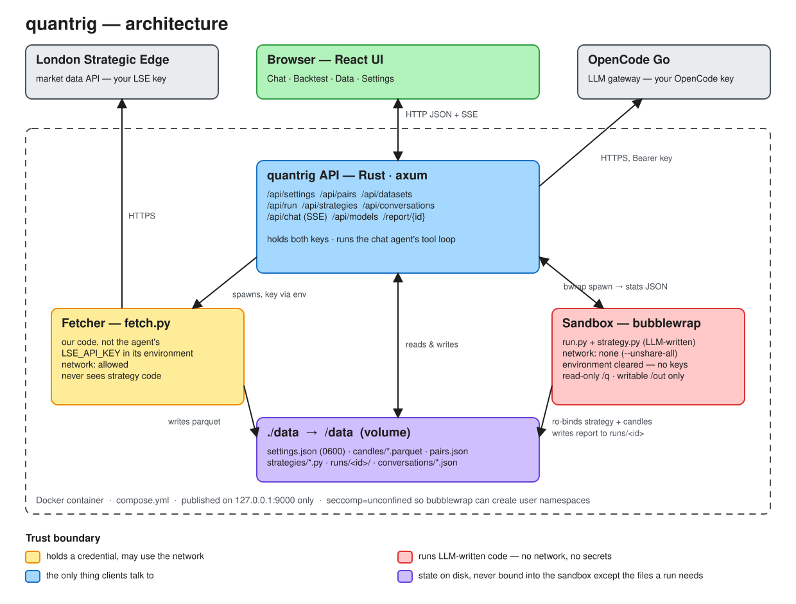

# quantrig

**A self-hosted harness for AI-driven FX strategy research.** Ask an agent for a trading
strategy, and it writes the Python, backtests it against real market data inside a locked-down
sandbox, and reports the numbers back. You bring your own data account and either an AI key or an eligible ChatGPT plan. Everything runs
on your machine.

> **Status: early development (v0.1.0).** Research and backtesting work end to end. Live trading,
> the MCP server and several other items in the [design notes](DECISIONS.md) are not built yet.
> See the [roadmap](#roadmap). Expect breaking changes.

- [What it does](#what-it-does)
- [Architecture](#architecture)
- [Security model](#security-model)
- [Quick start](#quick-start)
- [Using quantrig](#using-quantrig)
- [Local development](#local-development)
- [Configuration](#configuration)
- [HTTP API](#http-api)
- [Project layout](#project-layout)
- [Roadmap](#roadmap)
- [Known limitations](#known-limitations)
- [Editing the diagram](#editing-the-diagram)
- [Contributing](#contributing)
- [Licence](#licence)

## What it does

- **Chat agent that writes and tests strategies.** It talks to any model on
  [OpenCode Go](https://opencode.ai/go) or your connected ChatGPT account and has five tools: `list_strategies`,
  `read_strategy`, `write_strategy`, `list_datasets` and `run_backtest`. It can write a
  strategy, run it, read the stats and revise it, up to 8 steps per turn. Responses stream as
  they arrive. Conversations are saved and can be reopened.
- **Backtests in a sandbox.** Strategies are plain Python on
  [`backtestingfx`](https://pypi.org/project/backtestingfx/). Each run happens under
  [bubblewrap](https://github.com/containers/bubblewrap) with no network and no credentials,
  and returns summary stats plus an interactive HTML report.
- **Backtest projects and history.** Manual and chat-launched runs are saved in the
  Backtest sidebar, grouped by a strategy project such as Martingale across pairs and
  timeframes. Reopen a run to inspect its source, settings, statistics and report.
- **Market data.** FX, commodity and index candles come from [London Strategic Edge](https://londonstrategicedge.com/data)
  in 1m, 5m, 15m, 30m, 1h, 4h, 1d or 1w timeframes. They are stored locally as parquet.
- **Bring your own keys.** Market data and model access use your own accounts. quantrig never
  redistributes data or resells tokens.
- **One container.** A Rust API serves a React UI and does all the work behind it. State lives
  in a single `./data` directory.

## Architecture



<sub>Source: [`docs/architecture.excalidraw`](docs/architecture.excalidraw). See
[Editing the diagram](#editing-the-diagram).</sub>

quantrig runs as **one Docker container** with three parts. The split between them is the
core design decision (see [DECISIONS.md](DECISIONS.md)):

| Part | What it is | Holds keys? | Network? | Runs agent-written code? |
| --- | --- | --- | --- | --- |
| **API** ([`src/`](src)) | Rust, axum + tokio. Serves the UI, stores state, runs the chat agent's tool loop, and spawns the other two. | Yes: both | Yes: OpenCode Go | **No** |
| **Fetcher** ([`fetcher/fetch.py`](fetcher/fetch.py)) | Python subprocess, our own code. Pulls candles from London Strategic Edge and writes parquet. | Yes: `LSE_API_KEY`, passed in its environment | Yes: London Strategic Edge | **No** |
| **Sandbox** ([`src/sandbox.rs`](src/sandbox.rs) + [`runner/run.py`](runner/run.py)) | `bwrap` running a thin Python runner that loads one strategy file and calls `backtestingfx`. | **No**: environment cleared | **No**: all namespaces unshared | **Yes** |

Every client goes through the HTTP API, and nothing else touches the engine or the data
directory. Today the only client is the web UI. The planned MCP server and TUI would be
clients of the same API.

### How a request flows

**Downloading data.** On the Data screen the browser calls `POST /api/datasets`. The API
spawns `fetcher/fetch.py download …` with `LSE_API_KEY` in its environment. The fetcher pages
the candles endpoint 5,000 bars at a time, retrying transient failures. It normalises the
result to an OHLCV frame, writes `data/candles/<PAIR>@<tf>.parquet`, and prints a summary. The
API saves that summary as a `.json` sidecar next to the parquet file.

**Running a backtest.** On the Backtest screen, `POST /api/run` sends the strategy source. The
API writes it to `data/runs/<id>/strategy.py` and launches `bwrap`. Inside the sandbox the
runner, the strategy and the candles are mounted read-only under `/q`, and the run directory
is mounted writable at `/out`. The runner prints stats as JSON on stdout and writes
`report.html` to `/out`. The UI shows the stats and loads the report from `/report/<id>`.

**Chatting.** `POST /api/chat` opens a server-sent-events stream. The API calls OpenCode Go's
OpenAI-compatible `/chat/completions` with your key, then streams text, reasoning, tool calls
and tool results back to the browser. When the model calls `run_backtest`, the API runs it
through the same sandbox. After each turn the browser saves the transcript with
`PUT /api/conversations/{id}`.

### Stack

| Layer | Technology |
| --- | --- |
| API | Rust (edition 2024), [axum](https://github.com/tokio-rs/axum) 0.8, tokio, reqwest (rustls) |
| Sandbox | bubblewrap, running Python 3.12 + [`backtestingfx`](https://pypi.org/project/backtestingfx/) |
| Fetcher | Python 3.12 + [`lse-data`](https://pypi.org/project/lse-data/), pandas, pyarrow |
| UI | React 19, TypeScript, Vite, Tailwind CSS 4, shadcn/ui, AI Elements |
| Storage | Flat files under `./data`: JSON, parquet, Python |
| Packaging | Multi-stage `Dockerfile`: the Node and Rust toolchains stay in build stages and are not in the runtime image |

> DECISIONS.md plans SQLite and WebSockets. What is built today uses flat files and
> server-sent events. This README describes what is built.

## Security model

Strategy code is written by an LLM, so quantrig treats it as **untrusted**. The design rests on
one rule: *untrusted code never shares a process with credentials or with the network.*

**The sandbox** ([`src/sandbox.rs`](src/sandbox.rs)) runs every backtest as:

- `bwrap --unshare-all --die-with-parent --clearenv`: new user, network, PID, IPC, UTS and
  cgroup namespaces. There is no network interface, and the only environment variables are
  `PATH`, `HOME` and `LD_LIBRARY_PATH`.
- `/usr` and the Python prefix mounted read-only, plus a private `/tmp` and a minimal `/dev`.
  `/etc`, `/proc` and the data directory are not mounted.
- `runner/run.py`, the strategy and the candles mounted read-only under `/q`. The run's own
  directory is mounted writable at `/out`, which is the only writable path.

Tests in the same file check each of these: that a strategy cannot open a socket, cannot see
key-like environment variables, and cannot write outside `/out`.

**The fetcher** is the other side of the boundary. It sees the LSE key and the network, and
never sees strategy code. The API passes it the key as an environment variable of that one
subprocess.

**Keys** are entered on the Settings screen and stored in `data/settings.json` with mode `0600`
(best effort on bind mounts that don't support POSIX permissions). The API reports only
*whether* each key is set and never returns a key's value. Envelope encryption at rest is
planned (see the [roadmap](#roadmap)).

**Network exposure.** The API has **no authentication yet**. `compose.yml` publishes the
UI port on `0.0.0.0:9000` for network development, and when run outside Docker the binary binds `127.0.0.1:9000` by
default. Anything that can reach the port can use every endpoint, including the one that runs
code in the sandbox. Restrict access to trusted clients until the planned password gate exists.

**Why `seccomp=unconfined`.** bubblewrap builds the sandbox from a user namespace, and Docker's
default seccomp profile blocks `clone(CLONE_NEWUSER)`. Without the override the sandbox cannot
start at all, and the API returns an error that says so. This loosens the *container's* syscall
filter so that the *inner* boundary, between agent code and your keys and the network, can
exist. A custom seccomp profile that allows only `CLONE_NEWUSER` would be tighter. The trade-off
is documented in [`compose.yml`](compose.yml).

## Quick start

**Prerequisites:** Docker with Compose v2, a
[London Strategic Edge](https://londonstrategicedge.com/data) API key for market data, and an
[OpenCode Go](https://opencode.ai/go) API key or an eligible ChatGPT subscription for the chat agent. The Backtest and Data
screens work without the OpenCode key.

```sh
git clone https://github.com/KhizarImran/quantrig.git
cd quantrig
docker compose up -d --build
```

Open <http://localhost:9000>. The first build compiles the Rust API and the UI inside Docker,
which takes a few minutes. Later builds reuse cached layers. State is written to `./data`
next to `compose.yml`.

```sh
docker compose logs -f   # API and fetcher output
docker compose down      # stop; ./data is kept
```

## Using quantrig

The UI has four screens.

1. **Settings.** Connections are grouped into **AI** and **Data**. Add your London Strategic
   Edge key under Data. Under AI, save an OpenCode Go key or connect ChatGPT (see below).
2. **Data.** Pick an instrument, a timeframe and an optional date range, then download. FX history
   goes back to 2009. The built-in list includes FX pairs, `XAU/USD` (gold) and `US30`.
   *Refresh from LSE* replaces it with the live FX, commodity and index catalogue, cached
   in `data/instruments.json`. Available instruments and history depend on the provider.
   Downloaded datasets are listed
   with their row count and date span.
3. **Chat.** Choose an AI provider and a model and ask for a strategy, for example *"Write a mean-reversion
   strategy for EUR/USD 1h and backtest it"*. The agent writes the file, runs it and explains
   the results, and tool calls and their output appear inline. When the agent writes a
   strategy, it opens in a side panel where you can edit it and save it under a name. Past
   conversations are in the sidebar.
4. **Backtest.** Load a saved strategy or edit the example, give it a strategy name and
   choose or type a **Project** (for example Martingale). Use the same project for different
   pairs, timeframes and strategy variants. Choose a dataset, cash, spread and commission
   and run it. The sidebar saves completed and failed runs, newest first within each project.
   Click a run to reopen its exact source, settings, summary stats and HTML report; running
   it again creates a separate entry. **Move saved run to this project** changes its group.
   Runs from Chat also appear here; the agent can supply the project name. Blank projects
   go into **Ungrouped**. Older manual reports appear there too, but their original settings,
   dataset and summary stats were not persisted. Historical agent runs from before this
   feature cannot be recovered as full run records.
   Use the trash icon on a run to delete it, or the trash icon beside a project to delete
   all its displayed runs, including legacy Ungrouped reports. A confirmation shows the
   affected run count. Deletion removes run snapshots, results and reports permanently;
   saved strategy files and downloaded datasets are kept.

### Writing a strategy by hand

A strategy file contains exactly one `backtestingfx.Strategy` subclass. The sandbox allows
`backtestingfx` and the standard library, and has no network or file access beyond the
candles it is given. This is the example the Backtest screen starts with:

```python
from backtestingfx import Strategy

FAST, SLOW = 10, 30


class SmaCross(Strategy):
    def init(self):
        closes = [b.close for b in self._bars]
        self.long_signal = {}
        for i in range(SLOW - 1, len(closes)):
            window = closes[i - SLOW + 1 : i + 1]
            fast = sum(window[-FAST:]) / FAST
            slow = sum(window) / SLOW
            self.long_signal[self._bars[i].timestamp] = fast > slow

    def next(self):
        up = self.long_signal.get(self._bar.timestamp)
        if up is None:
            return
        if up and not self.positions:
            self.buy(lot_size=0.1)
        elif not up and self.positions:
            self.close_all()
```

Precompute indicators in `init()`. `next()` runs once per bar, so slow code there slows the
whole backtest.

### Connect a ChatGPT subscription

Rebuild with `docker compose up -d --build`, then open **Settings → AI → ChatGPT**.
The connector uses OpenAI's [open-source Sign in with ChatGPT flow](https://developers.openai.com/siwc/token-sharing-open-source/sign-in).
Eligible Plus/Pro requests use your ChatGPT plan allowance, subject to account and workspace
permissions. This does not import your existing ChatGPT conversations.

For a remote Docker server, configure a temporary SSH port forward on the computer running
your browser, using your SSH client or saved host alias. Keep it open while you click
**Continue with ChatGPT** and approve sign-in and plan usage. The browser returns to its
local callback port, forwarded through SSH to Quantrig. Settings updates automatically.
Close the port forward once connected, then choose **ChatGPT** and an
available model on Chat. Port 1455 must be free on your browser computer; stop another
local OAuth listener if SSH reports the port is occupied.

Tokens are stored atomically in `data/chatgpt.json` with owner-only permissions, refreshed
on demand, and excluded from strategy sandboxes. One ChatGPT account is retained; reconnect
with that same account after disconnecting. Cancel only stops a pending sign-in. Disconnect
attempts remote revocation, clears local tokens and reports if remote revocation could not
be confirmed. Usage and app permissions can also be managed in ChatGPT Settings.

ChatGPT uses [stateless Responses streaming](https://developers.openai.com/siwc/token-sharing-open-source/models-and-inference)
with the same five local tools. Reasoning and function-call items are saved with the chat
for later turns. Interrupted or failed responses do not execute pending tool calls.

## Local development

Running outside Docker needs:

- **Rust** 1.85 or newer (the crate uses edition 2024)
- **Node.js** 22 (the version the Dockerfile builds with) and npm
- **Python** 3.12 with the packages the image installs
- **bubblewrap** (`bwrap` on `PATH`) on Linux with unprivileged user namespaces enabled

```sh
# Python for the sandbox and the fetcher (.venv is git-ignored)
python3 -m venv .venv
.venv/bin/pip install "backtestingfx[report]" "lse-data[frames]" pandas pyarrow numpy

# UI: build once so the API can serve it from ui/dist
(cd ui && npm ci && npm run build)

# API on http://127.0.0.1:9000, state in ./data
QUANTRIG_PYTHON_PREFIX="$PWD/.venv" cargo run
```

For hot-reloading UI work, keep the API running and start Vite in another terminal. Its dev
server proxies `/api` and `/report` to `127.0.0.1:9000`:

```sh
cd ui && npm run dev
```

**Dev overlay for Docker.** [`compose.dev.yml`](compose.dev.yml) mounts `ui/dist`, `runner/`
and `fetcher/` from the host read-only. Changes to the UI or the Python scripts then take
effect without rebuilding the image, while changes to `src/*.rs` still need a rebuild:

```sh
docker compose -f compose.yml -f compose.dev.yml up -d
```

### Tests and checks

```sh
QUANTRIG_PYTHON_PREFIX="$PWD/.venv" cargo test   # Rust unit tests, incl. sandbox escape tests
.venv/bin/python fetcher/fetch.py selftest       # fetcher retry / paging / normalisation
(cd ui && npm run lint && npm run build)         # oxlint + TypeScript type-check and build
```

The sandbox tests call the real `bwrap` and need the Python prefix above. If one of them hangs,
run the suite under `timeout`.

## Configuration

The Docker image sets all of these. Outside Docker, the defaults assume you run from the
repository root.

| Variable | Default outside Docker | Set in the image to | Purpose |
| --- | --- | --- | --- |
| `QUANTRIG_ADDR` | `127.0.0.1:9000` | `0.0.0.0:9000` | Listen address. Compose publishes port 9000 on all host interfaces. |
| `QUANTRIG_CHATGPT_CALLBACK_ADDR` | `127.0.0.1:1455` | `0.0.0.0:1455` | OAuth listener. Compose publishes it on host loopback only; the browser callback is `http://127.0.0.1:1455/auth/callback`. |
| `QUANTRIG_DATA` | `data` | `/data` | State directory (the `./data` volume). |
| `QUANTRIG_UI` | `ui/dist` | `/app/ui/dist` | Built UI to serve. |
| `QUANTRIG_ROOT` | the crate directory | `/app` | Where `runner/` and `fetcher/` live. |
| `QUANTRIG_PYTHON_PREFIX` | `/usr` | `/usr/local` | Python install used for the sandbox and the fetcher (`<prefix>/bin/python3`). |

API keys are **not** read from environment variables. They are set on the Settings screen.

### What's in `./data`

```
data/
├── settings.json              # API keys, mode 0600
├── chatgpt.json               # ChatGPT identity, OAuth tokens and stable host ID, mode 0600
├── instruments.json           # cached LSE FX, commodity and index catalogue
├── candles/
│   ├── EUR_USD@1h.parquet     # OHLCV candles
│   └── EUR_USD@1h.json        # rows / start / end sidecar
├── strategies/*.py            # strategies saved by you or the agent
├── backtests/<id>.json        # project, source, settings, stats/error for each run
├── runs/<id>/                # strategy.py and report.html for manual and agent runs
└── conversations/*.json       # saved chats
```

Back up or delete this directory to keep or reset all state. It contains your API keys.

## HTTP API

All routes are defined in [`src/main.rs`](src/main.rs). Errors are returned as
`{"error": "..."}`. If a required key is missing, the API responds with `409`.

| Method | Path | Purpose |
| --- | --- | --- |
| `GET` | `/api/settings` | Which keys are set (`lse_api_key_set`, `opencode_api_key_set`). Never the keys. |
| `PUT` | `/api/settings` | Set `lse_api_key` and/or `opencode_api_key`. |
| `GET` | `/api/pairs` | FX, commodity and index catalogue, cached on disk. `?refresh=true` fetches it again. |
| `GET` | `/api/datasets` | Downloaded datasets with row count and span. |
| `POST` | `/api/datasets` | Download candles: `{symbol, timeframe, start?, end?}`. |
| `POST` | `/api/run` | Backtest `{code, dataset, cash, spread, commission, project?, strategy?}` and return the saved run. Failures return an error and remain in history. |
| `GET` | `/api/runs` | Backtest summaries, newest first, including project, strategy, dataset and status. |
| `GET` | `/api/runs/{id}` | Full saved run: source, settings, stats/error and report availability. |
| `PUT` | `/api/runs/{id}` | Move a saved run to `{project}`. |
| `DELETE` | `/api/runs/{id}` | Delete one run's metadata and artifacts. Returns `{deleted, failed}`. |
| `DELETE` | `/api/runs` | Delete the explicitly confirmed `{ids: [...]}`. Returns `{deleted, failed}`; new runs outside that snapshot are kept. |
| `GET` | `/api/strategies` | Saved strategy names. |
| `PUT` | `/api/strategies` | Save `{name, code}`. |
| `GET` | `/api/strategies/{name}` | One strategy's source. |
| `GET` | `/api/conversations` | Chat summaries, newest first. |
| `GET` `PUT` `DELETE` | `/api/conversations/{id}` | Load, save (up to 32 MB) or delete one chat. |
| `GET` | `/api/models?provider=opencode` | OpenCode Go public model list (default provider). |
| `GET` | `/api/models?provider=chatgpt` | Models available to the connected ChatGPT account, with display names. |
| `GET` | `/api/connections/chatgpt` | Account email, connection/plan status and pending sign-in; never tokens. |
| `POST` | `/api/connections/chatgpt/sign-in` | Start OAuth; JSON request required. Returns authorization URL. |
| `DELETE` | `/api/connections/chatgpt/sign-in` | Cancel pending OAuth without disconnecting the active account. |
| `DELETE` | `/api/connections/chatgpt` | Revoke the session and clear local tokens; reports unconfirmed remote revocation. |
| `POST` | `/api/chat` | One agent turn `{provider, model, session, messages}` (`provider` defaults to `opencode`), returned as a server-sent-events stream. |
| `GET` | `/report/{id}` | A run's HTML report. |

Example: set a key, download a dataset and list datasets with `curl`.

```sh
curl -X PUT localhost:9000/api/settings -H 'content-type: application/json' \
  -d '{"lse_api_key": "…"}'
curl -X POST localhost:9000/api/datasets -H 'content-type: application/json' \
  -d '{"symbol": "EUR/USD", "timeframe": "1h", "start": "2024-01-01"}'
curl localhost:9000/api/datasets
```

## Project layout

```
.
├── src/
│   ├── main.rs        # axum router and handlers: the HTTP API
│   ├── backtests.rs   # shared run execution, project grouping and saved history
│   ├── agent.rs       # chat agent: OpenCode Go client, tools, tool loop
│   ├── sandbox.rs     # bubblewrap invocation + sandbox escape tests
│   ├── fetcher.rs     # spawns fetch.py with the LSE key
│   └── store.rs       # ./data layout, settings, name validation
├── runner/run.py      # runs inside the sandbox: load strategy, backtest, print stats
├── fetcher/fetch.py   # outside the sandbox: LSE catalogue + paged candle download
├── ui/                # React + Vite app (screens in ui/src/screens)
├── docs/              # architecture diagram (.excalidraw source + SVG export)
├── Dockerfile         # UI build → Rust build → Python 3.12 + bwrap runtime
├── compose.yml        # the service: loopback port, ./data volume, seccomp note
├── compose.dev.yml    # dev overlay: live-mount UI build and Python scripts
└── DECISIONS.md       # scoping and design decisions
```

## Roadmap

These items are **planned in [DECISIONS.md](DECISIONS.md) and not built yet.**

- **MCP server** (rmcp). Would let your own agent CLI drive quantrig from the host with
  `list_strategies`, `write_strategy`, `run_backtest`, `get_results` and `import_data`, using
  its own auth.
- **Password gate and encrypted keys.** A login in front of the API and envelope encryption
  for stored keys, needed before quantrig leaves localhost.
- **Walk-forward / out-of-sample enforcement** in the runner, so an agent cannot report a
  curve-fit result as a win.
- **Live execution.** An MT5 bridge, reconciliation and kill switches, with one order-intent
  abstraction shared by backtest and live to limit semantic drift.
- **TUI** (ratatui). Monitoring-only, for live trading on a headless VPS.
- **Run queue and richer history.** Bounded concurrent backtests, and stored equity curves and trade lists
  alongside the scalar stats.
- **Template repo and published image.** The `git clone && docker compose up` distribution
  model described in DECISIONS.md.
- **Licence.** AGPL-3.0 or BSL, before the first outside contribution.

## Known limitations

- **No authentication.** Keep the port on loopback (see [Security model](#security-model)).
- **One backtest at a time per request.** Runs are synchronous, with no queue.
- **Stats are scalars only.** Equity curves and trade lists are in the HTML report, not in the
  API response.
- **Reports are served from the API's origin.** `report.html` is written into the run's
  writable `/out` directory and shown in an iframe without a `sandbox` attribute. Treat reports
  from strategies you have not read with the same caution as the strategies themselves.
- **Contract sizing is FX-only in backtests.** The runner currently uses the engine's
  100,000-unit contract default. Gold and index candles can be downloaded, but meaningful
  backtests require instrument-specific contract sizing, which is not exposed yet.
- **Linux containers only**, because the sandbox relies on bubblewrap and user namespaces.

## Editing the diagram

GitHub cannot render `.excalidraw` files, so the repository keeps both the source and an SVG:

- [`docs/architecture.excalidraw`](docs/architecture.excalidraw) is the editable source.
- [`docs/architecture.svg`](docs/architecture.svg) is the image embedded above.

To update it:

1. Open <https://excalidraw.com>, choose **Open** (or drag the file onto the canvas) and load
   `docs/architecture.excalidraw`.
2. Make your changes, then **Save to…** / download and replace `docs/architecture.excalidraw`.
3. **Export image → SVG**, with *Background* on and *Dark mode* off so it stays readable on
   GitHub's light and dark themes. Save it as `docs/architecture.svg`.
4. Commit both files together.

When the architecture changes, update the diagram and the [Architecture](#architecture) and
[HTTP API](#http-api) sections in the same pull request.

## Contributing

Issues and pull requests are welcome at
<https://github.com/KhizarImran/quantrig>. Before opening a PR:

- Read [DECISIONS.md](DECISIONS.md). In particular, keep the fetcher/sandbox split intact.
  Nothing that runs agent-written code may see a key or the network.
- Run the [tests and checks](#tests-and-checks).
- Keep this README accurate. If you change a route, a screen or the security model, update
  the matching section and the diagram.

## Licence

**No licence has been chosen yet**, and the repository has no `LICENSE` file. DECISIONS.md
plans AGPL-3.0 or BSL before the first outside contribution. Until a licence is added, normal
copyright applies.
